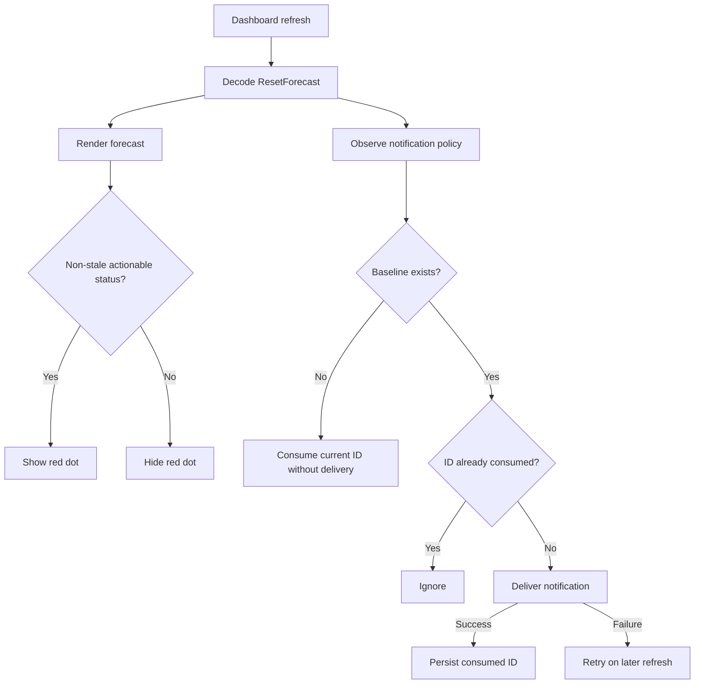
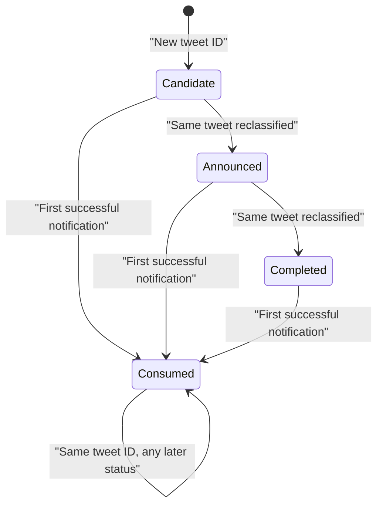

# Reset Signal 客户端通知与红点设计

## 状态

本设计覆盖 `codex-radar` macOS 客户端，是后端 `2026-07-28-tibo-single-table-monitoring-design.md` 的配套设计。

## 目标

客户端把非 stale 的 `candidate`、`announced` 和 `completed` 都视为需要用户注意的 reset 信号：

- 三种状态都可以触发系统通知；
- 三种状态都显示菜单栏红点；
- 同一个 `signal_id` 在同一台客户端上最多通知一次；
- 通知投递失败时允许后续刷新重试；
- 首次安装或升级看到已有信号时只建立 baseline，不补发历史通知。

后端保证 `signal_id` 等于真实 X tweet ID。客户端不向后端写 `notified_at`，也不使用跨设备共享的通知回执。

## 当前实现

当前代码已经具备：

- `ResetStatus.candidate` 数据模型；
- 基于 `UserDefaults` 的 baseline；
- 通知成功后才持久化 signal ID，失败时重试；
- Dashboard 在刷新结果未变化时仍执行通知观察；
- announced 与 completed 通知文案；
- `ResetForecastPresentation.hasResetAlert` 驱动红点。

当前限制：

- candidate 被通知策略和通知 presentation 排除；
- 红点只对 announced 显示；
- `lastObservedResetSignalID` 只能防止“连续相同 ID”重复，不能保证旧 ID 在其他信号之后再次出现时仍不通知。

## 通知策略

### 可通知状态

以下条件全部成立时，信号才进入通知判断：

```text
stale = false
status in [candidate, announced, completed]
signal_id != null
```

`monitoring`、stale 响应和缺少 signal ID 的响应不通知。

### 一次通知语义

客户端本地保存已消费 signal ID 集合：

```text
consumedResetSignalIDs
```

`UserDefaults` 中使用排序后的 JSON string array，内存中使用 `Set<String>`。排序保证写入稳定，集合保证查询语义明确。

规则：

1. 尚未建立 baseline 时，将当前非空 signal ID 加入集合并标记 baseline 已建立，但不发送通知。
2. baseline 已建立且 ID 已在集合中时忽略，即使同一 tweet 的 status 后续变化。
3. ID 不在集合中时尝试投递通知。
4. 只有系统通知中心确认 `add` 成功后，才把 ID 加入集合。
5. 权限未授权、presentation 无效或投递抛错时不消费 ID，后续刷新继续重试。

集合不设容量上限。reset 信号数量很小，而“一个 tweet ID 只通知一次”是持久语义；使用 LRU 截断会使旧信号重新通知。

### 现有偏好迁移

现有安装可能只有：

```text
hasResetSignalBaseline
lastObservedResetSignalID
```

首次读取新集合时：

- 保留 `hasResetSignalBaseline`；
- 如果 `lastObservedResetSignalID` 非空，将它加入新集合；
- 写入新集合后移除旧 `lastObservedResetSignalID`；
- 迁移幂等。

不清空用户已有 baseline，避免升级后补发当前历史信号。

### Candidate 文案

通知 presentation 增加 candidate：

```text
Title: Possible Codex reset detected
Body: A possible Codex reset signal was posted.
```

announced 与 completed 继续使用现有 timing-aware 文案。所有新增字符串进入现有本地化资源；缺少翻译时使用英文默认值。

## 红点策略

`ResetForecastPresentation.hasResetAlert` 改为：

```text
stale = false
status in [candidate, announced, completed]
```

红点表达“当前后端信号需要注意”，不是未读状态：

- 不读取 consumed signal ID 集合；
- 不因用户打开菜单或通知成功而消失；
- 后端返回 monitoring 或 stale 时消失；
- completed 由后端在确认推文发布 24 小时后投影为 monitoring，因此自然消失。

这样避免把每台客户端的阅读状态与服务端 reset 状态混在一起。

## 数据流



状态变化与 signal ID 的关系：



后端通常用新 tweet ID 表达新的信号；同一 tweet 被人工重新分类时，客户端不会再次通知。

## 组件修改

### `ResetNotificationPolicy`

- 将 candidate 加入可通知状态。
- 输入从单个 `lastSignalID` 改为 `Set<String>`。
- 保持纯函数，便于覆盖 baseline、去重和 stale 组合。

### `ResetNotificationPresentation`

- `Body` 增加 candidate case。
- candidate 不依赖 timing。
- announced/completed 行为保持不变。

### `ResetNotificationService`

- 增加已消费 ID 集合的编码、解码和旧偏好迁移。
- 只有 delivery 返回 true 才持久化新 ID。
- baseline 建立时消费当前 ID但不投递。
- 集合损坏时采用保守策略：保留 baseline，使用可恢复的旧 ID；记录错误，不主动补发当前信号。

### `ResetForecastPresentation`

- `hasResetAlert` 覆盖 candidate、announced、completed。
- time display 仍只对 announced 生效。

### `MenuBarController`

- 继续只消费 `hasResetAlert`，不引入通知存储依赖。
- 现有红点绘制、深浅色和 template icon 行为保持不变。

## 错误处理

- UserDefaults 集合解码失败：不崩溃；将旧 ID 与当前非空 signal ID 作为已消费集合重新写入，不补发当前信号，并通过现有日志设施记录恢复事件。
- 通知权限拒绝：不消费 ID，用户之后授权时可重试。
- Notification Center 投递失败：不消费 ID。
- stale 或 monitoring：不修改已消费集合。
- 缺少 signal ID：不通知，但 UI 仍按 forecast 状态渲染；后端 contract 测试应避免这种组合。

## 测试

### Policy

- candidate、announced、completed 的新 ID 都返回 notify。
- monitoring、stale、missing ID 均 ignore。
- 同一 ID 从 candidate 变为 announced 或 completed 仍 ignore。
- ID A、ID B、再次 ID A 时，第二次 A 仍 ignore。
- 初次看到 signal 只建立 baseline。
- 初次看到 monitoring 建立空 baseline。

### Service

- delivery 失败不消费 ID，下一次刷新重试。
- delivery 成功只消费一次。
- 旧 `lastObservedResetSignalID` 正确迁移进集合。
- 损坏偏好不导致历史通知风暴。

### Presentation

- candidate 生成固定通知文案。
- announced 保留 exact、estimated、imminent 文案。
- completed 保留完成文案。
- candidate、announced、completed 在非 stale 时都有红点。
- stale 与 monitoring 没有红点。

### Controller

- 三种 actionable 状态都更新菜单栏红点。
- stale 或 monitoring 清除红点。
- 打开菜单和通知成功不直接改变红点。

## 发布与兼容

客户端改动向后兼容现有后端：

- 旧后端已经可能返回 candidate；
- signal ID 仍是字符串；
- 不要求新增 API 字段。

因此推荐先发布客户端，再启用后端新单表数据。若后端先发布，旧客户端仍能展示 candidate 卡片，但不会发送 candidate 通知或显示 candidate 红点。

## 仓库边界

本仓库只修改客户端策略、持久化、本地化和测试。后端表结构、current 选择、completed 24 小时投影与内部接口不在本仓库实现。
